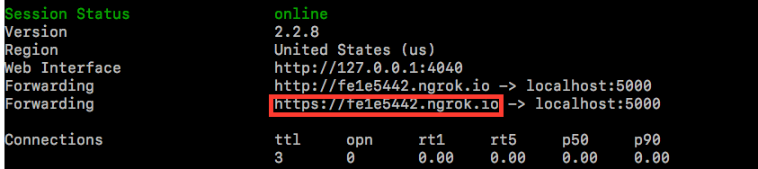
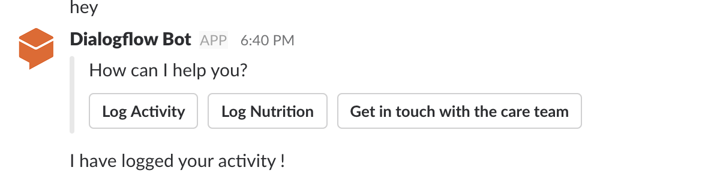

# Health slack bot - a slack bot using Dialogflow one-click integration. 

This is a webhook implementation that works with [Dialogflow](https://dialogflow.com/docs/integrations/) one-click integration of slack.

## What does the chat bot do?
This is a health information fulfillment service, which provides health related information or advice to users of slack.

## Setting up
I am currently using Python 2.7.12. And make sure that you have installed all packages in requirements.txt

* [Import Dialogflow zip file](#import_zip)
* [Running a local webhook server](#running_server)
* [Configure Dialogflow](#configure_dialogflow)


### <a name="import_zip" />Import Dialogflow zip file
1. Sign in Dialogflow using your Gmail account.
2. **GO TO CONSOLE**. Under menu, **Create new agent**.
3. Go to **settings**, choose **Export and Import**. Choose **IMPORT FROM ZIP** and select **health_agent.zip** in this respository.

### <a name="running_server" />Running a local webhook server
Here, we use **ngrok**, which helps to build a local server and provide an public IP. You could [download](https://ngrok.com/download) it from here.

1. Run the webhook server:

	```
	python app.py
	```

2. Run ngrok:

	```
	./ngrok http 5000
	```

	Make note of this URL (this will be used later).
	


### <a name="configure_dialogflow" />Configure Dialogflow

1. Go to **Fulfillment** of your agent, **enable** Webhook.

2. Put url from ngrok + /webhook in **URL**. For example, https: //fe1e5442.ngrok.io/webhook

3. Go to **Integration**, choose **Slack**. Make sure you select **Test in Slack**. Authorize **Dialogflow Bot** to access the Slack.

4. You are good to go. Now, you can talk to **Dialogflow Bot** in Slack.
   


## How to make contributions?
Please read and follow the steps in the [CONTRIBUTING.md](CONTRIBUTING.md).

## License
See [LICENSE](LICENSE).

## Terms
Your use of this sample is subject to, and by using or downloading the sample files you agree to comply with, the [Google APIs Terms of Service](https://developers.google.com/terms/).

This is not an official Google product
